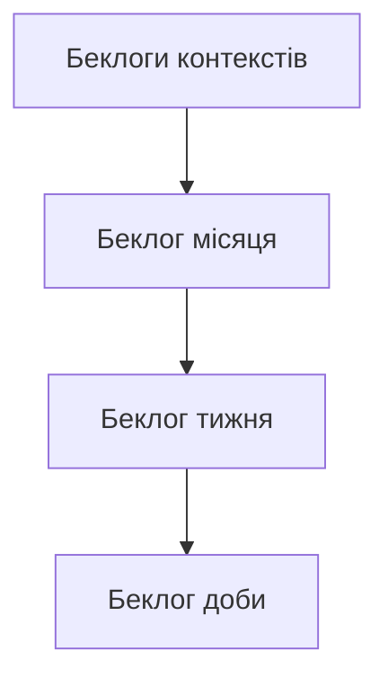

---
up:
  - "[[01. life-management-model]]"
---
# v1
## 📂Waypoint  %% fold %% 
%% Begin Waypoint %%
- **00-entities**
	- **[[00-main-beacons]]**
	- **[[01-realization-models]]**
	- **[[02-main-beacon-strategic-projecting]]**
	- **[[03-long-term-strategy]]**
	- **[[04-medium-term-program]]**
	- **[[05-week]]**
	- **[[06-operational]]**
	- **[[07-day]]**
	- **[[09-logging]]**
- **01-protocols**
	- **[[01-life-management-navigator-protocol]]**
	- **[[08-day-level-protocol]]**
	- [[02-main-beacons-protocol]]
	- [[03-main-beacon-realization-models-protocol]]
	- [[04-main-beacon-strategic-projecting-protocol]]
	- [[05-long-term-strategy-protocol]]
	- [[06-medium-term-strategy-protocol]]
	- [[07-week-protocol]]
- **02-validations**
	- [[01-main-beacons-validation]]
	- [[02-main-beacon-realization-models-validation]]
	- [[03-main-beacon-strategic-projecting-validation]]
	- [[04-long-term-strategy-validation]]
	- [[05-medium-term-program-validation]]
	- [[06-week-plan-validation]]
	- [[07-day-plan-validation]]
- **[[03-modes]]**
- **[[04-reviews]]**
- **05-lm-model-level-up**
	- [[1]]
	- [[2]]
	- [[3]]
	- [[4]]
	- [[5]]
	- [[покращення моделі ужд]]
- **06-another-models**
	- **[[general-future-projecting]]**
	- **information-system**
		- **[[new-info-processing]]**
		- [[pis]]
	- **new-info-processing**

%% End Waypoint %%
- **[[02. personal-management/02. strategic/core-models/life-management-model/main-beacons-management/main-beacons-management]]-management/02strategic/core-models/life-management-model/main-beacons-management/main-beacons-management]]al-management/strategic/core-models/life-management-model/main-beacons-management/main-beacons-management]]onal-management/beacons/core-models/life-management-model/main-beacons-management/main-beacons-management]]onal-management/beacons/core-models/life-management-model/main-beacons-management/main-beacons-management]]onal-management/beacons/core-models/life-management-model/main-beacons-management/main-beacons-management]]ypoint %%
## Model
- [[main-beacons]] - самі гол орієнтири
- [[long-term-strategy#Strategic vision fold]] - головні принципи як їх реалізувати
- кожному орієнтиру - окремий документ - проект отрієнтиру. цілі-складові необхідні для реалізації [[main-beacons]] - в беклогах документів орієнтирів. що ще залишається з довгострокоих цілей - в беклозі [[long-term-strategy]] 
- проекти орієнтирів, го, дсср описують р го на вищому рівні абстракції
- решта - це конкретна р на практиці в рамках 1м і нижче
- це - суть структури яку я маю р. вище її немає нічого
- 
## 📝Inbox 
- стратегія - це орієнтири, бачення, дорожні карти , програми відповідного масштабу 
- класифікувати всю роботу за зовн умовами, типом:
	- iw
		- piw 
		- oiw
		- siw
		- wiw 
		- diw
		- paiw
	- qmanual 
	- research 
- ключовим фактором успіху р усієї моєї системи є достатня реалізація на нижніх рівнях цілей, бачень, взагалі орієнтирів, які бути поставлені зверху. Є небезпека загрузнути в реалізації тактичних і локальних квестів, доланні оперативних, операційних труднощів, втрачаючи бачення того що слід робити і зробити яке було на вищих рівнях. А це бачення - головне при прийнятті рішень і на тактичному рівні. Треба навчитися з цим справлятися достатньо добре. 
- чим швидше досягнуто цілей які є фундаментом для інших тим швидше будуть досягнуті інші
- інновації в те що робиться і відчувається щодня дуже цінні. Бо впливають на Єва і загальну продуктивність . До цієї групи входять усі щоденні моделі жтд, моделі щпр, пр в ужд, пр взагалі.
- треба оцінювати реалізацію сс і дс стратегій під час проектування і огляду ті
- якщо в тебе пріоритет - ручна робота і ти не можеш з певних причин її робити - вибери ціль іншого роду - ментальна робота, та - і реалізуй її
- при реалізації скрум методології визначальне значення має дисципліна реалізації складових управління за методології. Я часто пропускаю огляди (тактичні і стратегічні), тому елемент вдосконалення жтд є хаотичним а не системним. мені треба краще перемикатися з стр рівня на тактичний , денний і так далі. А то коли треба діяти я на стр рівні думаю думи, а коли треба думати тактично думаю денно. В кращому випадку. Треба правильно свідомо визначати актуальний рівень і довести свої прояви на них усіх до досконалості. 
- головна проблема в тому що є те що потрібно робити щодня для норм життя і що це не робиться. Через мій свідомий вибір у тому числі 
- з впорядкованого сс стр беклогу брати цілі зверху і реалізовувати на рівні тижня 
- 
## ⚙️Model

в моїй системі є протиріччя. з одного боку цілі мають зберігатися в беклогах своїх доменів, проектів. з іншого - в консолідуючих беклогах (місяць, тиждень, день). так от по перше, це можна майже  нейтралізувати зробивши другий тип технічно контекстом. 

а по друге, можна встановлювати приблизні ліміти для кількості цілей з інших контекстів в беклогах консолідуючих. 1-5 на один тип максимум. 

з цього випливає що кандидати в цілі консолідуючих беклогів мають спершу з'являтися в беклогах контекстів. колишніх слотів діяльності

# v2
## Головні орієнтири
Є самі головні орієнтири, які для мене важливо досягти в житті - головні персональні орієнтири.

Вони такі
[[main-beacons]]
* [[main-beacons#Main primary beacons|головні первинні орієнтири]]
	* [[main-beacons#personal-mission|персональна місія]] 
	* [[main-beacons#Main values|головні цінності]] 
* [[main-beacons#Other main beacons|інші орієнтири]] 
	* [[main-beacons#Main goals|головні життєві цілі]]
	* [[main-beacons#life-story|обрана життєва історія]]

Первинні - це значить, що я б їх реалізовував при будь-яких життєвих обставин. Вони - головна мета мого існування. Службові орієнтири є інструментом досягнення первинних.

Го - самі головні орієнтири для мене. Первинними можуть бути й інші орієнтири, близькі серцю, але в го входять головні з них - гпо.

Важливим є не тільки самі орієнтири, але й те, які з них важливіші за інші і наскільки. Розумним є зробити розподіл балів між ними, подібно тому як робиться в рпг при генерації персонажів. Або однозначно виділити домінуючі і навколо них побудувати повністю свій життєвий сценарій.
## Особисте стратегічне управління
Стратегічний - значить такий, що визначає реалізацію головних життєвих орієнтирів. Такий який відповідає за шлях до цього, можливоті для цього.
### Довгострокова Стратегія
[[long-term-strategy]]
Дає відповідь на питання як максимально реалізувати головні орієнтири.  Якщо з поточної її версії не цілком ясно як їх реалізувати - значить вона недосконала і потребує уточнення. 

Огляд-висновки-перегляд - щомісяця або за потреби.
### Середньострокова Стратегія
Є сб, складові проекти, бл.
Огляд реалізації, висновки, перегляд - кожні 7 днів, після завершення ті або за потреби.
## Тактична ітерація
Кошик з пріоритетних 
- 3 цілі головні
- 3 цілі #pm 
- 3 цілі #manual⚒️ 
- 3 цілі #hqm 
Є беклог. Складові проекти відсутні. Крім випадків, коли в кожному з них чітко виділені цілі поточної ті.
Перегляд цілей ті - після їх реалізації але не пізніше ніж через 3 дні після їх затвердження. 

В документі ті обов'язково має бути 
- статус ті:
	- виконується
	- прострочена
	- несформована
- дата закінчення

## День
* [[high-level-every-day]]
* Щодня на початку доби разом з її проектуванням  - огляд, висновки реалізації поточної ті.
* [[reflections]]
## Цілі
### Організація цілей конкретного домену
Нехай є певний проект, чи відносно велика ціль, чи особиста програма - назову це доменом. Щодо організації великої кількості складових проектів, цілей, під-цілей у мене наступний підхід. Він є застосовним для тактичних ітерацій, стратегічних програм будь-яких маштабів, будь-яких проектів. 
- Цілі домену розподіляються по двом розділам: складові проекти і беклог. 
- Складові проекти (або просто проекти) - це більші, маштабніші цілі домену, досягнення яких вимагає проектування. Це цілі, які мають свої власні беклоги та часто - складові проекти. Цілі, які не можна виконати за одну тактичну ітерацію, тобто за кілька днів. А якщо і можна, то їх зручно сприймати саме як окремий проект.
- Беклог. З одного боку це - також список усіх інших цілей. З іншого - в вершині беклогу мають бути УСІ актуальні на поточний момент обов'язкові, пріоритетні цілі домену, включаючи такі цілі з беклогів складових проектів. Беклог - це завжди актуальна черга  цілей, наступних для виконання в рамках даного домену, впорядкованих так, щоб на його вершині були самі пріоритетні цілі.
- Коли цілі беклогів складових робляться актуальними для всього домену, їх можна перенести в беклоги вищих рівнів, якщо так буде зручно.
Така організація дозволяє оперувати доменом на разних рівнях абстракції - кожен раз на такому, який є оптимальним для даної ситуації прийняття рішень.
### Статус цілей 
- #urgent
- #losses
	- #critical🆘 
	- #alarming⚠️ 
- #day 
- #tactical🔥 
- #middle-term⭐  
- #long-term 
- #main-beacon 
	- #main-primary
- #primary

### Значення цілей 
Ефективність цілей = рейтинг цінності * коефіцієнт впливу цілі на цінність 

